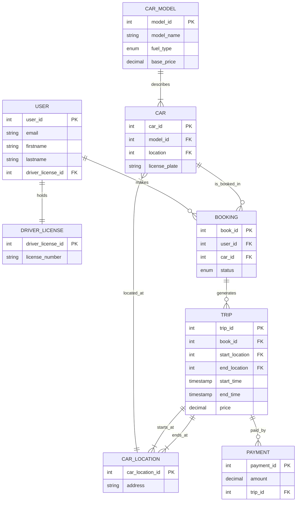

# Car Rental API 🚗

A backend API for a car rental service, developed as coursework for a Database Systems course. This project demonstrates the implementation of a relational database schema and the use of an ORM (Object-Relational Mapping) tool to execute complex data manipulation and analytical queries.

## 👥 Team

*   **Maksym Kramarenko**
*   **@edw4rdkk**

## 🎯 Project Goals

*   Design a normalized database schema for a rental system.
*   Implement a RESTful API using **FastAPI**.
*   Utilize **SQLAlchemy** for database interactions.
*   Demonstrate proficiency in:
    *   Complex analytical queries (aggregations, joins, window functions).
    *   Data manipulation transactions (booking flows, payment processing).
    *   Database migrations using **Alembic**.

## 🛠️ Tech Stack

*   **Language:** Python 3.10+
*   **Framework:** FastAPI
*   **Database:** PostgreSQL
*   **ORM:** SQLAlchemy
*   **Migrations:** Alembic

## 🗂️ Database Schema (ERD)

The core of the application revolves around the following entity relationships:



## 🚀 Getting Started

1. **Clone the repository:**
```zsh
git clone https://github.com/Maks9m/Car-Rental-API
cd car-rental-api
```

2. **Create a virtual environment:**

A virtual environment isolates the project's dependencies from your global Python installation, ensuring consistency and preventing conflicts.

```zsh
python3 -m venv venv
source venv/bin/activate
```

3. **Install dependencies:**
```zsh
pip install -r requirements.txt
```

4. **Start DB (on Docker)**
```zsh
docker compose up -d
```

5. **Run Migrations:**
```zsh
alembic upgrade head
```

6. **Run Dev**
```zsh
python -m fastapi dev src/main.py
```
