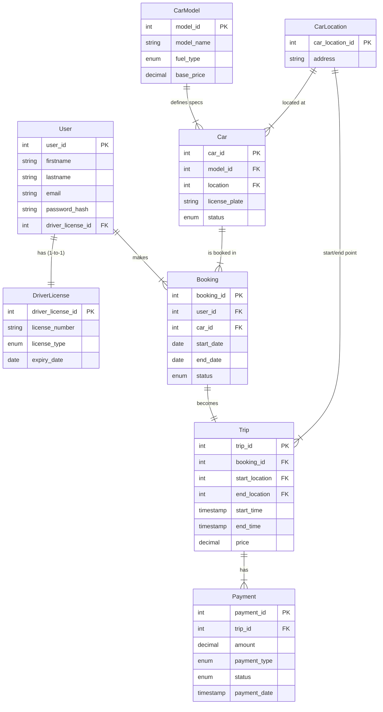

# Документація схеми бази даних

## 📊 Діаграма сутність-зв'язок (ERD)

## 📝 Опис таблиць

### Таблиця: `user` (Користувачі)
**Призначення:** Зберігає облікові дані та персональну інформацію клієнтів.

| Стовпець | Тип | Обмеження | Опис |
|----------|-----|-----------|------|
| user_id | INTEGER | PRIMARY KEY | Унікальний ідентифікатор користувача |
| firstname | VARCHAR(50) | NOT NULL | Ім'я користувача |
| lastname | VARCHAR(50) | NOT NULL | Прізвище користувача |
| email | VARCHAR(100) | UNIQUE, NOT NULL | Електронна пошта (логін) |
| password_hash | VARCHAR(255) | NOT NULL | Хешований пароль |
| driver_license_id | INTEGER | FK, UNIQUE, NULL | Посилання на водійське посвідчення |

**Індекси:** `ix_user_email` (для швидкого пошуку при логіні).

---

### Таблиця: `driver_license` (Водійські права)
**Призначення:** Зберігає деталі водійського посвідчення для перевірки права на керування.

| Стовпець | Тип | Обмеження | Опис |
|----------|-----|-----------|------|
| driver_license_id | INTEGER | PRIMARY KEY | Ідентифікатор документа |
| license_number | VARCHAR(20) | UNIQUE, NOT NULL | Номер посвідчення |
| license_type | ENUM | NOT NULL | Категорія прав (A, B, C...) |
| expiry_date | DATE | NOT NULL | Дата закінчення дії прав |

---

### Таблиця: `car_model` (Моделі авто)
**Призначення:** Довідник моделей автомобілів із базовими характеристиками.

| Стовпець | Тип | Обмеження | Опис |
|----------|-----|-----------|------|
| model_id | INTEGER | PRIMARY KEY | Ідентифікатор моделі |
| model_name | VARCHAR(100) | UNIQUE, NOT NULL | Назва моделі (напр., "Tesla Model S") |
| fuel_type | ENUM | NOT NULL | Тип пального (PETROL, DIESEL, ELECTRIC) |
| base_price | DECIMAL(10, 2) | NOT NULL, Check > 0 | Базова ціна оренди за добу |

---

### Таблиця: `car_location` (Локації)
**Призначення:** Зберігає адреси пунктів видачі та повернення авто.

| Стовпець | Тип | Обмеження | Опис |
|----------|-----|-----------|------|
| car_location_id | INTEGER | PRIMARY KEY | Ідентифікатор локації |
| address | VARCHAR(255) | UNIQUE, NOT NULL | Фізична адреса пункту |

---

### Таблиця: `car` (Автомобілі)
**Призначення:** Конкретні екземпляри автомобілів у автопарку.

| Стовпець | Тип | Обмеження | Опис |
|----------|-----|-----------|------|
| car_id | INTEGER | PRIMARY KEY | Ідентифікатор автомобіля |
| model_id | INTEGER | FK, NOT NULL | Посилання на модель |
| location | INTEGER | FK, NOT NULL | Поточне місцезнаходження авто |
| license_plate | VARCHAR(20) | UNIQUE, NOT NULL | Номерний знак |
| status | ENUM | NOT NULL | Статус (AVAILABLE, RENTED, MAINTENANCE) |

---

### Таблиця: `booking` (Бронювання)
**Призначення:** Основна транзакційна таблиця для резервування авто.

| Стовпець | Тип | Обмеження | Опис |
|----------|-----|-----------|------|
| booking_id | INTEGER | PRIMARY KEY | Ідентифікатор бронювання |
| user_id | INTEGER | FK, NOT NULL | Користувач, що забронював |
| car_id | INTEGER | FK, NOT NULL | Заброньований автомобіль |
| start_date | DATE | NOT NULL | Дата початку оренди |
| end_date | DATE | NOT NULL | Дата завершення оренди |
| status | ENUM | NOT NULL | Статус (PENDING, CONFIRMED, CANCELED...) |

---

### Таблиця: `trip` (Поїздки)
**Призначення:** Фіксує факт реальної поїздки на основі бронювання.

| Стовпець | Тип | Обмеження | Опис |
|----------|-----|-----------|------|
| trip_id | INTEGER | PRIMARY KEY | Ідентифікатор поїздки |
| booking_id | INTEGER | FK, UNIQUE | Посилання на бронювання |
| start_time | TIMESTAMP | DEFAULT NOW() | Фактичний час початку |
| end_time | TIMESTAMP | NULL | Фактичний час завершення |
| price | DECIMAL(8, 2) | Check >= 0 | Фінальна вартість поїздки |

---

### Таблиця: `payment` (Оплати)
**Призначення:** Фінансові транзакції за поїздки.

| Стовпець | Тип | Обмеження | Опис |
|----------|-----|-----------|------|
| payment_id | INTEGER | PRIMARY KEY | Ідентифікатор транзакції |
| trip_id | INTEGER | FK, NOT NULL | Посилання на поїздку |
| amount | DECIMAL(10, 2) | NOT NULL, Check > 0 | Сума оплати |
| payment_type | ENUM | NOT NULL | Тип (CREDIT_CARD, CASH...) |
| status | ENUM | NOT NULL | Статус оплати (PENDING, COMPLETED...) |
| payment_date | TIMESTAMP | NOT NULL | Час транзакції |

## 💡 Рішення щодо дизайну

### Нормалізація
База даних спроєктована з дотриманням принципів **3-ї нормальної форми (3NF)** для уникнення надлишковості даних:

1.  **Розділення сутностей:**
    * Характеристики автомобілів (назва, тип пального, базова ціна) винесені в таблицю `car_model`. Це дозволяє змінювати характеристики моделі в одному місці, не оновлюючи кожен автомобіль окремо.
    * Адреси винесені в таблицю `car_location`, що стандартизує пункти видачі.
    * Дані водійського посвідчення (`driver_license`) відокремлені від таблиці користувачів (`user`), що дозволяє зберігати історію або додавати підтримку кількох документів у майбутньому без зміни структури таблиці користувачів.

### Обмеження (Constraints) & Цілісність даних
Для гарантування валідності даних на рівні БД використано:

* **ENUM Types:** Використовуються для полів зі сталим набором значень (`FuelType`, `CarStatus`, `Status`, `LicenseType`, `PaymentType`). Це запобігає запису некоректних статусів (наприклад, "unknown_status").
* **CHECK Constraints:**
    * Для фінансових полів встановлені обмеження: `price >= 0` (в таблиці `trip`) та `amount > 0` (в таблиці `payment`). Це унеможливлює появу від'ємних цін або оплат.
    * Для моделей авто: `base_price >= 0`.
* **Foreign Keys & Cascades:**
    * Використовується стратегія `ondelete="SET NULL"` для полів `start_location` та `end_location` у таблиці `trip`. Це критично важливо для збереження історії поїздок: якщо локацію закриють (видалять з довідника), історичні дані про поїздки залишаться доступними.

### Стратегія індексування
Індекси створені для оптимізації найчастіших запитів:

1.  **Унікальні бізнес-ключі:**
    * `email` (User) — для швидкого пошуку при автентифікації.
    * `license_plate` (Car), `license_number` (DriverLicense) — для уникнення дублікатів та пошуку.
2.  **Зовнішні ключі (Foreign Keys):**
    * Всі поля зв'язків (наприклад, `user_id` та `car_id` у `booking`, `booking_id` у `trip`) мають явно встановлений `index=True`. Це значно пришвидшує операції `JOIN`, які часто використовуються в аналітичних запитах (наприклад, при генерації рейтингу користувачів).
